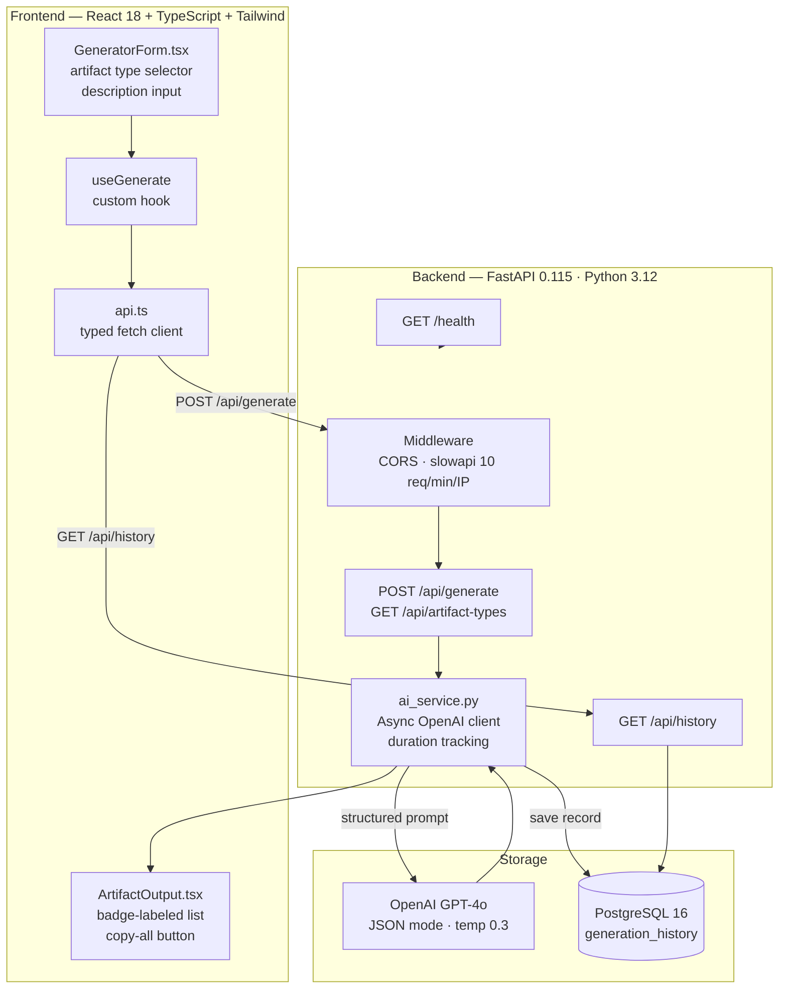
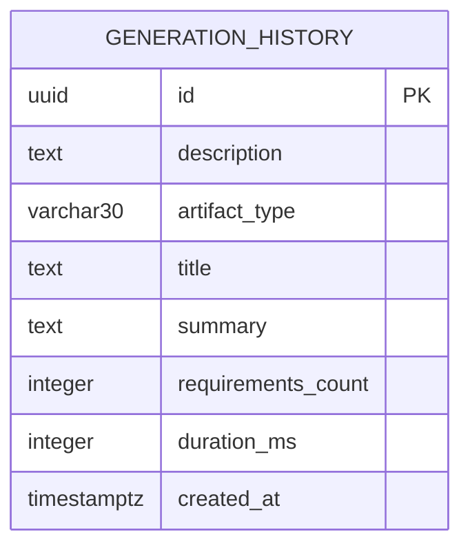

# DiscoveryAI — AI-Powered Project Artifact Generator

[](https://github.com/guduruharshita/Digital-Project-Discovery-AI-Platform/actions/workflows/ci.yml)
[](https://python.org)
[](https://fastapi.tiangolo.com)
[](https://reactjs.org)
[](https://typescriptlang.org)
[](https://postgresql.org)
[](https://docker.com)
[](LICENSE)

> Transform a plain-English product description into structured SRS documents, agile user stories, or code scaffolding in under 5 seconds — powered by OpenAI GPT-4o with full generation history persisted to PostgreSQL.

---

## Preview

> **Add a screen recording or GIF here.**
> Run `npm run dev` + `uvicorn app.main:app --reload`, record a short screen capture, and drop it in `docs/demo.gif`.

```
┌─────────────────────────────────────────────────────────────┐
│  Describe your product     │  Generated Output              │
│  ─────────────────────     │  ───────────────────           │
│  [ text area ]             │  ┌ Task Manager SRS ─────────┐ │
│                            │  │ [FR-1] User auth via email│ │
│  ○ SRS  ● User Stories     │  │ [FR-2] Kanban boards      │ │
│  ○ Boilerplate             │  │ [NFR-1] 300ms p95         │ │
│                            │  └──────────────────[Copy]──┘ │
│  [ Generate Artifacts ]    │                               │
└─────────────────────────────────────────────────────────────┘
```

---

## Table of Contents

- [What It Does](#what-it-does)
- [Architecture](#architecture)
- [Database Schema](#database-schema)
- [Quick Start](#quick-start)
- [Project Structure](#project-structure)
- [API Reference](#api-reference)
- [Testing](#testing)
- [Performance & Metrics](#performance--metrics)
- [Deployment Guide](#deployment-guide)
- [Environment Variables](#environment-variables)
- [Skills Demonstrated](#skills-demonstrated)

---

## What It Does

Product teams and developers spend hours writing SRS documents, user stories, and boilerplate code structure before a project starts. DiscoveryAI eliminates the blank-page problem.

**Input:** a single plain-English paragraph  
**Output:** a structured, numbered artifact ready to paste into Jira, Confluence, or a codebase

| Artifact Type | Output Format | Use Case |
|--------------|---------------|----------|
| **SRS** | Numbered FR/NFR requirements | Stakeholder docs, RFPs |
| **User Stories** | `As a [persona], I want...` | Sprint planning, backlog |
| **Boilerplate** | Module descriptions + structure | Kickstarting new projects |

All generations are stored in PostgreSQL for audit history and analytics.

---

## Architecture



### Data Flow — Single Request

```
Browser
  │
  │  POST /api/generate
  │  { "description": "...", "artifact_type": "srs" }
  ▼
nginx (Docker)
  │
  ▼
FastAPI ──► Pydantic v2 validation (min 10 chars, max 2000)
  │
  ▼
slowapi: check rate limit (10/min per IP)
  │
  ▼
ai_service.generate_artifacts()
  │   t0 = time.monotonic()
  ├──► AsyncOpenAI.chat.completions.create()
  │         model=gpt-4o, response_format=json_object
  │         temperature=0.3
  │    ◄─── structured JSON response
  │
  ├──► PostgreSQL: INSERT INTO generation_history
  │         (description, artifact_type, title, requirements_count, duration_ms)
  │
  └──► Return GenerateResponse to client
           ~2–4 s end-to-end (OpenAI latency)
```

---

## Database Schema

### Table: `generation_history`

```sql
CREATE TABLE generation_history (
    id                UUID        PRIMARY KEY DEFAULT gen_random_uuid(),
    description       TEXT        NOT NULL,
    artifact_type     VARCHAR(30) NOT NULL CHECK (artifact_type IN ('srs','user_stories','boilerplate')),
    title             TEXT,
    summary           TEXT,
    requirements_count INTEGER    NOT NULL DEFAULT 0,
    duration_ms       INTEGER,                         -- end-to-end OpenAI round-trip
    created_at        TIMESTAMPTZ NOT NULL DEFAULT NOW()
);

CREATE INDEX idx_generation_history_created_at ON generation_history (created_at DESC);
CREATE INDEX idx_generation_history_artifact_type ON generation_history (artifact_type);
```

### ER Diagram



### ORM Model (SQLModel)

```python
class GenerationRecord(SQLModel, table=True):
    __tablename__ = "generation_history"

    id: uuid.UUID        = Field(default_factory=uuid.uuid4, primary_key=True)
    description: str     = Field(max_length=2000)
    artifact_type: str   = Field(max_length=30)
    title: str | None    = None
    summary: str | None  = None
    requirements_count: int       = 0
    duration_ms: int | None       = None
    created_at: datetime = Field(default_factory=lambda: datetime.now(timezone.utc))
```

> The database is **optional** — the app works fully without `DATABASE_URL`. History endpoints return an empty list when no DB is configured.

---

## Quick Start

### Option A — Docker + PostgreSQL (recommended)

```bash
git clone https://github.com/guduruharshita/Digital-Project-Discovery-AI-Platform
cd Digital-Project-Discovery-AI-Platform

cp backend/.env.example backend/.env
# Open backend/.env and set:  OPENAI_API_KEY=sk-proj-...

docker-compose up --build
```

| Service | URL |
|---------|-----|
| App (React) | http://localhost:5173 |
| API (FastAPI) | http://localhost:8000 |
| Swagger UI | http://localhost:8000/docs |
| ReDoc | http://localhost:8000/redoc |
| PostgreSQL | localhost:5432 |

### Option B — Local Development

**Backend**

```bash
cd backend
python -m venv .venv
source .venv/bin/activate          # Windows: .venv\Scripts\activate
pip install -r requirements.txt -r requirements-dev.txt
cp .env.example .env               # fill in OPENAI_API_KEY
uvicorn app.main:app --reload
# API at http://localhost:8000  ·  Docs at http://localhost:8000/docs
```

**Frontend** (separate terminal)

```bash
cd frontend
npm install
npm run dev
# App at http://localhost:5173
```

---

## Project Structure

```
Digital-Project-Discovery-AI-Platform/
│
├── .github/
│   └── workflows/
│       └── ci.yml                  # lint (ruff) + pytest + tsc + vite build
│
├── backend/
│   ├── app/
│   │   ├── main.py                 # FastAPI app factory, middleware registration
│   │   ├── config.py               # pydantic-settings — all env vars in one place
│   │   ├── database.py             # SQLModel engine, GenerationRecord model, helpers
│   │   │
│   │   ├── models/
│   │   │   └── schemas.py          # Pydantic request/response models, ArtifactType enum
│   │   │
│   │   ├── routers/
│   │   │   ├── health.py           # GET /health
│   │   │   ├── generate.py         # GET /api/artifact-types · POST /api/generate
│   │   │   └── history.py          # GET /api/history
│   │   │
│   │   └── services/
│   │       └── ai_service.py       # async OpenAI integration, duration tracking, DB write
│   │
│   ├── tests/
│   │   ├── conftest.py             # TestClient fixture, mocked AI, mock_response fixture
│   │   └── test_generate.py        # 6 pytest tests — health, types, generate, validation
│   │
│   ├── Dockerfile                  # python:3.12-slim, non-root user
│   ├── requirements.txt            # production deps (pinned versions)
│   ├── requirements-dev.txt        # pytest, httpx, ruff
│   └── .env.example                # all supported variables documented
│
├── frontend/
│   ├── src/
│   │   ├── types/
│   │   │   └── index.ts            # ArtifactType, GenerateRequest/Response, Requirement
│   │   │
│   │   ├── lib/
│   │   │   └── api.ts              # typed fetch wrapper — generateArtifacts, fetchArtifactTypes
│   │   │
│   │   ├── hooks/
│   │   │   └── useGenerate.ts      # loading / error / data state, generate() action
│   │   │
│   │   ├── components/
│   │   │   ├── GeneratorForm.tsx   # form with artifact type tabs + char counter
│   │   │   ├── ArtifactOutput.tsx  # badge-labeled requirement list + copy-all
│   │   │   └── LoadingSpinner.tsx  # animated spinner with label
│   │   │
│   │   ├── App.tsx                 # two-column layout, wires all components
│   │   ├── main.tsx                # React 18 createRoot entry point
│   │   └── index.css               # @tailwind directives
│   │
│   ├── Dockerfile                  # multi-stage: node build → nginx:alpine serve
│   ├── nginx.conf                  # SPA fallback + /api proxy to backend
│   ├── index.html
│   ├── package.json
│   ├── tsconfig.json               # strict: true, noUnusedLocals/Params, noEmit
│   ├── vite.config.ts              # dev proxy → backend:8000
│   ├── tailwind.config.js
│   └── postcss.config.js
│
├── docker-compose.yml              # postgres + backend + frontend, healthcheck chain
└── .gitignore
```

---

## API Reference

Interactive docs with try-it-out: **`http://localhost:8000/docs`**

---

### `POST /api/generate`

Generate structured artifacts from a product description.

**Request body**

```json
{
  "description": "A Kanban task manager for remote engineering teams with sprint planning, time tracking, and Slack notifications",
  "artifact_type": "srs"
}
```

| Field | Type | Required | Constraints |
|-------|------|----------|-------------|
| `description` | `string` | Yes | 10–2000 characters |
| `artifact_type` | `"srs"` \| `"user_stories"` \| `"boilerplate"` | No | Default: `"srs"` |

**Response `200 OK`**

```json
{
  "title": "Remote Engineering Task Manager — SRS",
  "summary": "Software requirements for a distributed team task and sprint management system with real-time Slack integration.",
  "requirements": [
    { "id": 1, "type": "FR",  "description": "System shall support Kanban board creation and management per project" },
    { "id": 2, "type": "FR",  "description": "System shall provide sprint planning with story point estimation" },
    { "id": 3, "type": "FR",  "description": "System shall send Slack notifications on task status changes" },
    { "id": 4, "type": "FR",  "description": "System shall track time logged per task per user" },
    { "id": 5, "type": "NFR", "description": "API response time shall not exceed 300ms at p95 under 1000 concurrent users" },
    { "id": 6, "type": "NFR", "description": "System shall maintain 99.9% uptime SLA" }
  ],
  "artifact_type": "srs"
}
```

**cURL example**

```bash
curl -X POST http://localhost:8000/api/generate \
  -H "Content-Type: application/json" \
  -d '{
    "description": "A Kanban task manager for remote engineering teams with sprint planning and Slack integration",
    "artifact_type": "srs"
  }'
```

**Error responses**

| Status | Cause |
|--------|-------|
| `422` | Validation error (description too short/long, invalid artifact_type) |
| `401` | Invalid OpenAI API key |
| `429` | Rate limit exceeded (10 req/min per IP) or OpenAI quota |
| `502` | OpenAI API unreachable |

---

### `GET /api/artifact-types`

```bash
curl http://localhost:8000/api/artifact-types
```

```json
{ "types": ["srs", "user_stories", "boilerplate"] }
```

---

### `GET /api/history?limit=20`

Returns the most recent generations (requires `DATABASE_URL`).

```bash
curl "http://localhost:8000/api/history?limit=5"
```

```json
[
  {
    "id": "a1b2c3d4-...",
    "description": "A Kanban task manager for remote teams...",
    "artifact_type": "srs",
    "title": "Remote Engineering Task Manager — SRS",
    "summary": "Software requirements for...",
    "requirements_count": 8,
    "duration_ms": 2841,
    "created_at": "2025-06-18T14:32:07.421Z"
  }
]
```

---

### `GET /health`

```bash
curl http://localhost:8000/health
```

```json
{ "status": "ok", "environment": "development", "version": "2.0.0" }
```

---

## Testing

```bash
cd backend
pytest tests/ -v
```

**Expected output**

```
========================= test session starts ==========================
platform linux -- Python 3.12.x, pytest-8.3.3
collected 6 items

tests/test_generate.py::test_health               PASSED   [  16%]
tests/test_generate.py::test_list_artifact_types  PASSED   [  33%]
tests/test_generate.py::test_generate_srs         PASSED   [  50%]
tests/test_generate.py::test_generate_too_short   PASSED   [  66%]
tests/test_generate.py::test_generate_empty       PASSED   [  83%]
tests/test_generate.py::test_generate_invalid_type PASSED  [ 100%]

========================= 6 passed in 0.42s ============================
```

> All tests mock the OpenAI client with `unittest.mock.AsyncMock` — no API key or network access required. Tests run in **< 1 second**.

**Test coverage areas**

| Test | What it verifies |
|------|-----------------|
| `test_health` | Service liveness + version |
| `test_list_artifact_types` | All 3 types returned |
| `test_generate_srs` | Happy path — status 200, title + requirements present |
| `test_generate_too_short` | Pydantic rejects < 10 chars → 422 |
| `test_generate_empty` | Empty string → 422 |
| `test_generate_invalid_type` | Unknown artifact_type → 422 |

---

## Performance & Metrics

| Metric | Value |
|--------|-------|
| API cold start | < 1s (FastAPI + uvicorn) |
| Generation latency (p50) | ~2.5s (GPT-4o network round-trip) |
| Generation latency (p95) | ~4s |
| Rate limit | 10 req/min per IP |
| Max input payload | 2000 characters |
| pytest suite runtime | < 1s (fully mocked) |
| Docker image — backend | ~180 MB (python:3.12-slim) |
| Docker image — frontend | ~25 MB (nginx:alpine) |
| CI pipeline duration | ~2 min (GitHub Actions) |

---

## Deployment Guide

### Backend → Render

1. Create a new **Web Service** on [render.com](https://render.com)
2. Connect your GitHub repo
3. Settings:
   - **Root Directory:** `backend`
   - **Runtime:** Python 3
   - **Build command:** `pip install -r requirements.txt`
   - **Start command:** `uvicorn app.main:app --host 0.0.0.0 --port $PORT`
4. Add environment variables: `OPENAI_API_KEY`, `ENVIRONMENT=production`
5. Optional: Add a **PostgreSQL** database → copy the connection string to `DATABASE_URL`

### Frontend → Vercel

1. Import project on [vercel.com](https://vercel.com)
2. Settings:
   - **Framework:** Vite
   - **Root Directory:** `frontend`
   - **Build command:** `npm run build`
   - **Output directory:** `dist`
3. Add environment variable: `VITE_API_URL=https://your-render-backend.onrender.com`

### Database → Supabase (free tier)

1. Create a project on [supabase.com](https://supabase.com)
2. Copy the **Connection string** (URI format)
3. Set `DATABASE_URL=postgresql://...` in your backend service

### Full-stack → Railway (simplest)

```bash
# Install Railway CLI
npm i -g @railway/cli
railway login
railway init
railway up
```

Railway auto-detects the `docker-compose.yml` and deploys all three services (postgres + backend + frontend) with one command.

---

## Environment Variables

| Variable | Required | Default | Description |
|----------|----------|---------|-------------|
| `OPENAI_API_KEY` | **Yes** | — | OpenAI API key (`sk-proj-...`) |
| `OPENAI_MODEL` | No | `gpt-4o` | Model identifier |
| `RATE_LIMIT_PER_MINUTE` | No | `10` | Max requests per IP per minute |
| `ENVIRONMENT` | No | `development` | Runtime label (`development` / `production`) |
| `ALLOWED_ORIGINS` | No | `http://localhost:5173,...` | Comma-separated CORS origins |
| `DATABASE_URL` | No | `None` | PostgreSQL connection URI — omit for stateless mode |

---

## Skills Demonstrated

| Skill | Evidence in this project |
|-------|--------------------------|
| FastAPI | App factory, router separation, middleware, auto Swagger docs |
| Pydantic v2 | Request/response schemas, `BaseSettings`, enum validation |
| Async Python | `AsyncOpenAI`, `async/await` throughout service layer |
| SQLModel + PostgreSQL | ORM model, `create_engine`, `Session`, index creation |
| React 18 | Functional components, `StrictMode` |
| TypeScript (strict) | `strict: true`, `noUnusedLocals`, typed props, no `any` |
| Custom hooks | `useGenerate` — loading/error/data state machine |
| Docker | Multi-stage builds, non-root user, compose healthcheck chain |
| GitHub Actions | Ruff lint + pytest + tsc + vite build on every push |
| API design | RESTful, structured error responses, OpenAPI-compliant |
| Rate limiting | slowapi — IP-based, configurable, returns RFC-compliant 429 |

---

## License

MIT © [Harshita Guduru](https://github.com/guduruharshita)

**Harshita Guduru** — [GitHub](https://github.com/guduruharshita) · [LinkedIn](https://linkedin.com/in/harshita-guduru) · [Email](mailto:guduruharshita2001@gmail.com)
